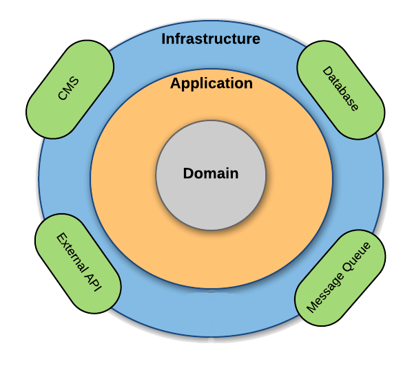

## Arquitectura Hexagonal con SpringBoot + TDD (Desarrollo guiado por Test)

### Stack de Tecnologías

| Logo                                                                                                                                                                                                                                                                                                | Tipo                       | Nombre             | Enlace                      | Versión                                                                  |
| --------------------------------------------------------------------------------------------------------------------------------------------------------------------------------------------------------------------------------------------------------------------------------------------------- |----------------------------|--------------------| ----------------------------------- |--------------------------------------------------------------------------|
|                                                                                                                                                                                                  | Lenguaje                   | Java               | https://www.oracle.com/java | 11                                                                       |
|                                                                                                                                                                                                                                     | Ambiente de desarrollo     | IntelliJ IDEA      | https://www.jetbrains.com/es-es/ | 2021.1.3                                                                 |
|                                                                                                                                                                                | Manejador de Dependencias  | Maven              | https://gradle.org/        | 3.8.1                                                                    |
|                                                                                                                                                          | Manejador de base de datos | H2 Database Engine | https://www.h2database.com/html/main.html | 2.1.210                                                                  |
|                                                                                                                                                                  | Framework                  | Spring Boot        | https://spring.io/projects/spring-boot | 2.6.4                                                                    |
|                                                                                                                                                                                                                    | Testing                    | Mockito            | https://site.mockito.org/  | 4.0                                                                      |
|                                                                                                                                                                                                                                                  | Testing                    | JUnit              | https://junit.org/junit5/ | 5.8.2                                                                    |
|                                                                                                                                                                                                                                                  | Mapper                     | MapStruct          | https://mapstruct.org/ | 1.4.2.Final                                                              |
|                                                                                                                                                                                                                                                  | Eficiencia y Legibilidad   | Lomok              | https://projectlombok.org/ | 1.18.20                                                                  |
|                                                                                                                                                                                                                                                  | ORM / Persistencia         | JPA Hibernate      | https://hibernate.org/ | _HIBERNATE_ 5.1.2.Final (Annotations) - 5.6.5.Final (Core)   _JPA_ 2.6.2 |

### Construcción de la Aplicación (build)

---

Para hacer build de la aplicación y que la misma pueda funcionar debe hacer los siguientes pasos dentro del IDE 
IntelliJ IDEA:

- Ejecute el proyecto lanzando la tarea `build` de Gradle.

### Ejecución de la Aplicación

---
- Ejecute el proyecto lanzando la tarea `bootRun` de Gradle para levantar la aplicación.
- Una vez realizados los pasos anteriores solo queda hacer solicitudes a la aplicación mediante la url 
`http://localhost:8080/price/{fechaDeAplicacion}/{IdProducto}/{IdMarca}`

### Ejecución de las Pruebas Automatizadas

---

Para la ejecución de las prueba se deben realizar los siguiente pasos:

- Ejecute el proyecto lanzando la tarea `test` de Gradle para ejecutar los test unitarios.

### Pruebas Postman

Se ha añadido al raiz del proyecto, un archivo llamado `HexagonalArchitecture.postman_collection.json` el cual podremos
importarlo a nuestra coleccion postman para hacer pruebas REST de la aplicación.

### Configuración BBDD H2
En el archivo `resources/application.properties` tendremos la siguiente configuración: 

`spring.datasource.url=jdbc:h2:mem:testdb` 
`spring.datasource.driverClassName=org.h2.Driver` 
`spring.datasource.username=root` 
`spring.datasource.password=root` 
`spring.jpa.database-platform=org.hibernate.dialect.H2Dialect` 
`spring.jpa.defer-datasource-initialization=true`  
Descomentaremos las siguientes lineas cuando queramos activar la consola para ver la BBDD H2: 
`spring.h2.console.enabled=true` 
`spring.h2.console.path=/h2` 
 

### Enunciado de la aplicación

En la base de datos de comercio electrónico de la compañía disponemos de la tabla PRICES que refleja el precio final 
(pvp) y la tarifa que aplica a un producto de una cadena entre unas fechas determinadas. A continuación se muestra un 
ejemplo de la tabla con los campos relevantes:

#### Tabla: _PRICES_
| BRAND_ID | START_DATE | END_DATE | PRICE_LIST | PRODUCT_ID |PRIORITY| PRICE  | CURR   |
|------|------|----------|------|------|------|--------|--------|
|1|2020-06-14-00.00.00|2020-12-31-23.59.59|1|35455|0| 35.50  |EUR|
|1|2020-06-14-15.00.00|2020-06-14-18.30.00|2|35455|1| 25.45  |EUR|
|1|2020-06-15-00.00.00|2020-06-15-11.00.00|3|35455|1| 30.50  |EUR|
|1|2020-06-15-16.00.00|2020-12-31-23.59.59|4|35455|1| 38.95  |EUR|

#### Campos:

- _BRAND_ID_: foreign key de la cadena del grupo.
- _START_DATE_ , END_DATE: rango de fechas en el que aplica el precio tarifa indicado.
- _PRICE_LIST_: Identificador de la tarifa de precios aplicable.
- _PRODUCT_ID_: Identificador código de producto.
- _PRIORITY_: Desambiguador de aplicación de precios. Si dos tarifas coinciden en un rago de fechas se aplica la de 
- mayor prioridad (mayor valor numérico).
- _PRICE_: precio final de venta.
- _CURR_: ISO de la moneda.

#### Se pide:

Construir una aplicación/servicio en SpringBoot que provea una end point rest de consulta  tal que:

_Acepte como parámetros de entrada:_ fecha de aplicación, identificador de producto, identificador de cadena. 
_Devuelva como datos de salida_: identificador de producto, identificador de cadena, tarifa a aplicar, fechas de 
aplicación y precio final a aplicar.

Se debe utilizar una base de datos en memoria (tipo h2) e inicializar con los datos del ejemplo, (se pueden cambiar el 
nombre de los campos y añadir otros nuevos si se quiere, elegir el tipo de dato que se considere adecuado para los 
mismos).

Desarrollar unos test al endpoint rest que  validen las siguientes peticiones al servicio con los datos del ejemplo:

-          Test 1: petición a las 10:00 del día 14 del producto 35455   para la brand 1 
-          Test 2: petición a las 16:00 del día 14 del producto 35455   para la brand 1 
-          Test 3: petición a las 21:00 del día 14 del producto 35455   para la brand 1 
-          Test 4: petición a las 10:00 del día 15 del producto 35455   para la brand 1 
-          Test 5: petición a las 21:00 del día 16 del producto 35455   para la brand 1 

 © 2022 GitHub, Inc.
